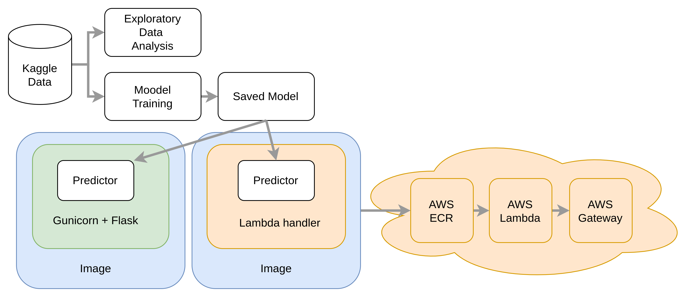

# MLE Project for Parkinson Assessment

This repository was created as part of the [Data-zoomcamp ML engineering course](https://github.com/DataTalksClub/machine-learning-zoomcamp/tree/master) by Andrew Tsai. This project has been submitted as the midterm project for the course.

I chose this dataset because I'd been tackling a problem on Kaggle competition a while back, and I wanted to see if I could apply what I'v learned in the course to a real-world scenario and deploy models to the cloud.

## Parkinson Severity Assessment- the problem scope

[Accelerating Medicines Partnership Parkinson's Disease (AMP PD)](https://www.kaggle.com/competitions/amp-parkinsons-disease-progression-prediction/overview) is a Kaggle competition that aims to find a cure for Parkinson's disease. Parkinson's disease is a degenerative brain disorder that affects movement and other functions. The competition involves using data science to analyze protein and peptide levels in Parkinson's patients and predict their progression using [MDS-UPDR scores](https://www.ncbi.nlm.nih.gov/pmc/articles/PMC5898442/#:~:text=Each%20parkinsonian%20sign%20or%20symptom,worst%20possible%20disability%20from%20PD.). The goal is to identify biomarkers and develop new treatments for the disease.


On top of it, I aim to deploy the trained model to the cloud and make it available for use via an API. The API will take in ***a list of values of patient's visit months*** and return the predicted MDS-UPDR scores.

## Project flowchart

## Navigating the project repository 📂

Where to find the files for evaluation:

-  **Exploratory Data Analysis**  
    I ran one notebook to do the analysis. A copy of it is in the [repository](notebooks/EDA.ipynb).

-  **Scripts**  
    - ***Train***: [train.py](./Scripts/train.py) runs the training for the final models. 
    - ***Predict***: Predictions can be ran within either a [lambda handler](https://docs.aws.amazon.com/lambda/latest/dg/python-handler.html) (the predict function can be found within [lambda.py](app-lambda-function/lambda_function.py)) or a [Gunicorn local service](https://docs.gunicorn.org/en/stable/deploy.html) (the predict function can be found within [predict.py](app-flask/predict.py)).
-  **Deployment**  
    The lambda function is deployed on [AWS Lambda](https://aws.amazon.com/lambda/) with an [API Gateway](https://aws.amazon.com/api-gateway/) sat in front of it. This end point will remain available until the end of the evaluation period.
    
    *Example request to the Lambda Gateway API in python script:*

    ``` python
    import requests
    url = 'https://x8ee6c4ds4.execute-api.ap-southeast-2.amazonaws.com/test/predict'
    data = {'data': [1,1,1,1]}
    print(requests.post(url, json=data).json())
    ```

    *Example response*

    ```
    {'updrs_1': 4.899986842559807, 'updrs_2': 6.644429461169236, 'updrs_3': 20.466737232954546, 'updrs_4': 0.09874205289906657}
    ```


## Running the project ⚙️
### Prepare the repository 
```sh
git clone https://github.com/AndrewTsai0406/project-parkinson.git
```
  or
```
Download ZIP
```

### Start a virtual environment 

I advise using a virtual environment for running this project, below are instructions for doing so using [Conda](https://www.anaconda.com/) which helps one manage multiple envirnoments. Additionally if you would like to run the app in Docker you will need to have [Docker](https://docs.docker.com/get-docker/) installed.


```sh
# create virtual environment
conda create -n project-parkinson python=3.10

# start the virtual environment
conda activate project-parkinson

# install requirements
pip install -r requirements.txt
```

### Data preparation

The data used for this project is gathered from [Kaggle](https://www.kaggle.com/competitions/amp-parkinsons-disease-progression-prediction/data) and has the [CC BY-SA 3.0 License](https://creativecommons.org/licenses/by-sa/3.0/). It consists of protein abundance values derived from mass spectrometry readings of cerebrospinal fluid (CSF) samples gathered from several hundred patients. Each patient contributed several samples over the course of multiple years while they also took assessments of PD severity.


Download this data (including the three CSVs) and put it in to a `./data` directory. The directory should look like this:

------------
    data
    ├── raw               
    │   ├── amp_pd_peptide  <- Files that enable the API. Expect the API to deliver all of the data (less than 1,000 additional patients) in under five minutes and to reserve less than 0.5 GB of memory. A brief demonstration of what the API delivers is available here.
    │   ├── amp_pd_peptide_310
    │   ├── example_test_files <- Data intended to illustrate how the API functions. Includes the same columns delivered by the API (ie no updrs columns).
    │   ├── supplemetnal_clinical_data.csv <- Clinical records without any associated CSF samples. This data is intended to provide additional context about the typical progression of Parkinsons. Uses the same columns as train_clinical_data.csv.
    │   ├── train_clinical_data.csv
    │   ├── train__peptides.csv <- Mass spectrometry data at the peptide level. Peptides are the component subunits of proteins.
    │   ├── train_proteins.csv <- Protein expression frequencies aggregated from the peptide level data.

------------

### Training & saving the models

To run the training script and save the mdoels, use the one script inside `./scripts`: `train.py` with the command:

```sh
cd ./scripts
python train.py
```

The final models, which corresponds to each [MDS-UPDR scores](https://www.ncbi.nlm.nih.gov/pmc/articles/PMC5898442/#:~:text=Each%20parkinsonian%20sign%20or%20symptom,worst%20possible%20disability%20from%20PD.), will be saved in the `.models` directory.

### Running the app locally for prediction

Please note that I ran the app locally on a macos. The following codes are expected to work **only** on macos machines.

#### Run the lambda server

To build and run the lambda server I use the following docker commands.

```sh
docker build -t project-parkinson ./app-lambda-function
docker run -p 8080:8080 project-parkinson
```

Test with script:
```python
import requests
url = 'http://localhost:8080/2015-03-31/functions/function/invocations'
data = {'data': [1,2,3,4]}
print(requests.post(url, json=data).json())
```

#### Run the Gunicorn server

To build and run the Gunicorn server I use the following docker commands.

```sh
docker build -t project-parkinson ./app-flask
docker run -p 6969:80 project-parkinson
```

Test with script:
```python
import requests
url = 'http://0.0.0.0:6969/predict'
data = {'data': [1,2,3,4]}
print(requests.post(url, json=data).json())
```

--------